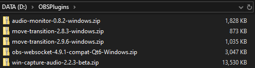

# Plugin Manager for OBS

This is a third-party OBS plugin manager for OBS

The objective is to be able to keep track of the Plugins that you have installed and to be easy as possible to add or remove them

## Installation

Currently we only provide a zip/portable application so... Unpack the zip contents on a folder of your liking, optionally create a shortcut on your desktop

The app will require you to have .net core 7 runtime, Don't have it? No worries, the app will send you to a link where you can download it

With the required runtime installed, you are ready to start

## Use

Before starting it's recommended for you to create a folder to store your plugins on zip format like the example below

At the main screen pick the location for your OBS installation, you'll get notified if obs.exe was not found in the selected folder, but you can use it anyway if you require it

NOTE: You must pick the path that contains all of OBS's files and folders, not just the bin folder

Now pick the one where your OBS plugins on zip format are

The program will read the files recognized as OBS plugins and show them in the list, then you can add or remove them one by one

NOTE: Program will not check if plugins supports your current platform, remember to download the right one for you

If a plugin is found in to be installed the app will show it's status as Installed an the date when you installed it

Add and remove plugins from your OBS install path freely, remove will only remove them from the OBS path

You can switch to a different OBS path too, all your changes will be there once you get back to your original OBS path

## Planned additions

This app is codded in .net core to be portable, plans for a Linux and Mac releases are contemplated

App won't show plugins removed from plugin folder, even if there are installed in your OBS path, that will be changed

Other notifications and validations will be added

## Notes

Manual remove or modification of the plugins will not be tracked by the app

Bugs and missing notifications reports are welcome, feature request is allowed too

I made this app for me but I hope it will be useful to you too